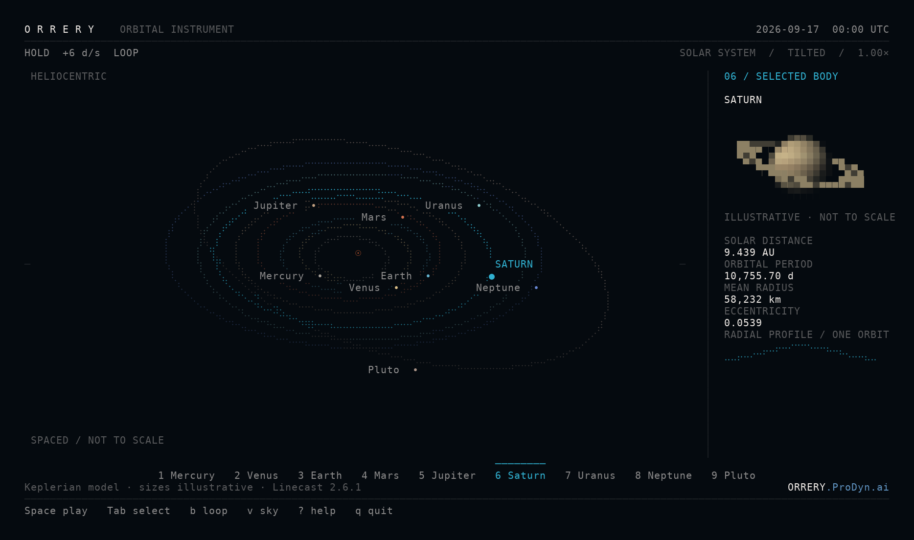
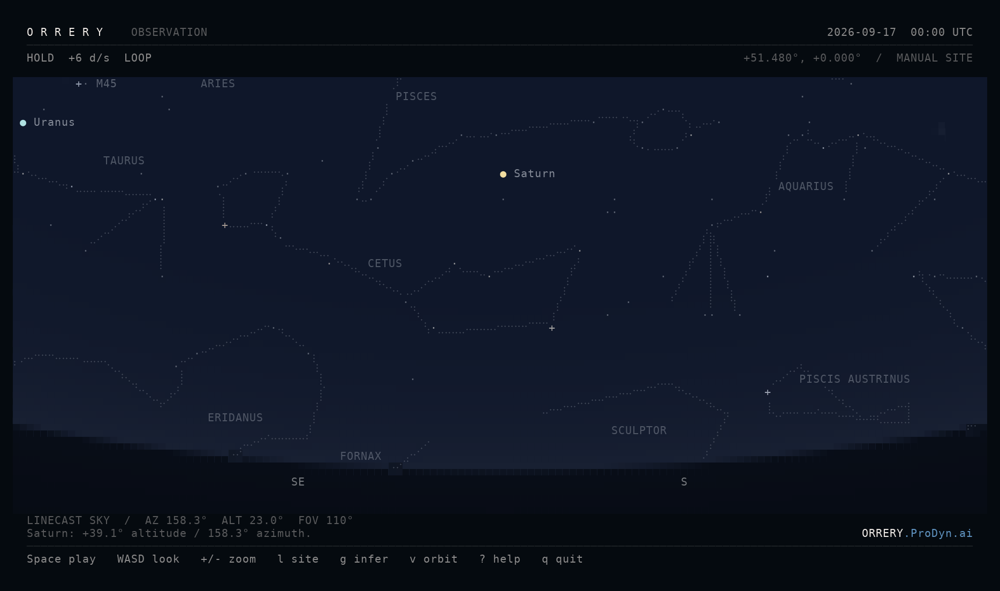

# Native Orrery

`linecast orrery` is a heliocentric orbital instrument alongside the existing observer-centred `linecast sky`. Eight planets and Pluto, selectable portraits, orbital geometry, and a shared UTC clock.



## Try it

In this branch's isolated environment:

```sh
uv run linecast orrery
uv run linecast orrery --theme orrery --loop
uv run linecast orrery --view sky --location=51.48,0
uv run linecast orrery --print --width 120 --height 40
uv run linecast orrery --json --date 2000-01-01T12:00:00Z
```

Native terminal-theme colours are the default. `--theme orrery` retains the authored dark/cyan palette. `LINECAST_COLOR` and `NO_COLOR` follow normal Linecast precedence.

- Space or `p`: pause/play. `,` / `.`: slower/faster. `r`: reverse.
- `b` / `--loop`: toggle bounded-date looping; off by default. Overshoot wraps in both directions.
- `[` / `]`: step a day. `n`: reset to current UTC and pause.
- Tab / `1`–`9` / click: select a body.
- `+` / `-` / wheel: zoom. `a` / `d` / drag: rotate.
- `u`: spaced lanes or physical AU scale. `i`: inner/full system. `t`: tilted/top-down.
- `v`: switch orbit/sky at the same UTC instant, pausing on entry.
- `l`: enter manual latitude,longitude. `g`: confirm approximate public-IP lookup.
- Sky: WASD/drag to look; `c` for figures; `m` to face the Moon.
- `?`: help. `q`: clean exit and terminal restoration.

## Observing site

No automatic geolocation, saved-site import, or persistent site write occurs. Both views share the same session-only observing coordinates. `--infer-location` explicitly opts into a network lookup, or press `g` and confirm. Results are labeled inferred/approximate; manual coordinates remain available. Network failure leaves the instrument usable offline.



The example site in these captures is 51.48° N, 0° longitude, not an inferred personal location. A site changes the observing view, not heliocentric orbital geometry.

## Astronomy and limits

The orbital range is inclusive **0001-01-01 through 3000-01-01 UTC**. It preserves the original JPL Table 1 fit in 1800–2050 and uses Table 2 with the required corrections outside it. The fit switches have a small discontinuity. Python's standard date type cannot represent BC years.

Coordinates are heliocentric J2000 mean ecliptic/equinox, in AU. Earth represents the Earth–Moon barycenter. UTC approximates dynamical time. These are educational approximations, not navigation ephemerides.

The adjacent sky retains its separate Linecast model. Outside the modern interval, the UI shows an accuracy notice instead of implying that the extended orbital range validates the sky ephemeris. See [astronomy details](orrery-astronomy.md) and [source/license notices](../THIRD-PARTY-NOTICES.md).

## Integration

The port lives inside the Linecast package. It uses `LiveApp.run`, native key decoding, and explicit per-call sky dimensions/banner options. It replaces no Linecast module globals. Dispatch, help, optional short-name links, and Bash/Zsh/Fish/Nushell completion include the command.

Orrery labels currently use explicit English fallback; the embedded sky can use existing translated catalogues. Additional Orrery translations remain open work, not claimed coverage.

The test suite includes direct CLI/layout/science/consent checks and a real POSIX controlling-terminal test for the printable quit path. Source/wheel tests require no companion checkout. [Verification record](orrery-verification.md).
